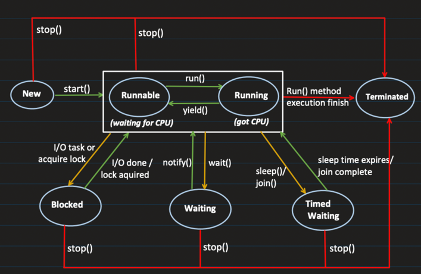

# Thread Lifecycle and Creation in Java

### Process vs Thread

- A **process** starts when you run your program (e.g., running bytecode).
- A **thread** is the smallest sequence of instructions that can be executed within a process.

When you start a process in the JVM, by default, the **main thread** is created. From the **main thread**, you can create multiple threads. These threads are **CPU independent** and run concurrently, depending on the available CPU resources.

---

### Memory Segments in a Process

1. **Heap:**
    - Stores newly created objects using the `new` keyword.
    - Local to the process.

2. **Data Segment:**
    - Stores global and static variables.
    - Local to the process.

3. **Code Segment:**
    - Stores machine code.
    - It is **static** (read-only). Once the machine code is generated, the process and threads run on top of it.
    - Local to the process.

4. **Program Counter (PC) / Counter:**
    - Points to the location in machine code up to where the current logic of the thread is executed.
    - It helps track the flow of the thread’s execution.

5. **Stack:**
    - Works like an actual stack in memory, storing function calls and local variables.

6. **Registers:**
    - Small, fast storage locations in the CPU used to store intermediate data and results of computations. They are crucial for executing instructions and managing the thread's context during execution.

---

### Why Can You Call `run()` Multiple Times, but Not `start()`?

- **Thread Lifecycle:**
    - A thread goes through various states:
        - **New**
        - **Runnable**
        - **Running**
        - **Terminated**
    - Once a thread is started using the `start()` method, it enters the running state and can only go through its lifecycle once. If you attempt to call `start()` on a thread that has already been started, an `IllegalThreadStateException` will be thrown.

- **Direct Execution of `run()` Method:**
    - Calling the `run()` method directly does not create a new thread. Instead, it just executes the `run()` method in the **current thread**. Therefore, you can call `run()` as many times as you like, but it will **not create a new thread** — it simply runs the logic in the existing thread.

```java
public class Main {
    public static void main(String[] args) {
        MultiThreadingLearning multiThreadingLearning = new MultiThreadingLearning();
        Thread thread = new Thread(multiThreadingLearning);

        // Start the thread (executes the run() method in a new thread)
        thread.start();
        
        // This will just execute run() in the main thread (not a new thread)
        thread.run();

        // Calling start() again will throw IllegalThreadStateException
        // thread.start(); // Uncommenting this will cause an exception IllegalThreadStateException
    }
}
```

### Two Ways to Create a Thread in Java

1. **Using `implements Runnable`**
2. **Extending `Thread`**

Both of these approaches are used in the class where your custom `run()` method resides.

---

### Recommended Approach

It is generally recommended to create a thread using the `Runnable` interface. This approach is preferred because:

- The class can extend another class (since Java does not support multiple inheritance).
- You can implement `Runnable` and pass it to a `Thread` object, allowing greater flexibility.

In contrast, if you extend the `Thread` class, you cannot extend any other class, as Java only supports **single inheritance**.




# Thread Lifecycle States
# **Java Thread Lifecycle with Descriptions and Examples**

| **State**         | **Description** | **Example Scenario**                                                                                                                                                                             |
|-------------------|---------------|--------------------------------------------------------------------------------------------------------------------------------------------------------------------------------------------------|
| **New**          | - Thread has been created but not started.<br>- It's just an object in memory. | `Thread t = new Thread();` → Thread object is created but not started yet.                                                                                                                       |
| **Runnable**     | - Thread is ready to run.<br>- Waiting for CPU time. | `t.start();` → Thread is ready to run and waiting for CPU time.                                                                                                                                  |
| **Running**      | - Thread starts executing its code. | Inside `public void run() { System.out.println("Thread is running"); }` → Thread is executing its task.                                                                                          |
| **Blocked**      | - A runnable thread goes into this state in different scenarios:<br>  - **I/O Operations**: Like reading from a file or database.<br>  - **Lock Acquired**: If a thread wants to lock a resource already locked by another thread, it has to wait.<br>- Releases all the **MONITOR LOCKS**. | **Thread A** holds a lock on `obj`, **Thread B** tries to acquire it and goes into **Blocked** state:<br> ```synchronized(obj) { // Thread A is using this resource }```                         |
| **Waiting**      | - A thread enters this state when `wait()` is called, making it non-runnable.<br>- It returns to the runnable state once `notify()` or `notifyAll()` is called.<br>- Releases all the **MONITOR LOCKS**. | We studied this in producer consumer problem, when the item was not available for consumer and goes to wait state, and when it's available the producer notifies waiting state using nofiyAll(); |
| **Timed Waiting** | - A thread waits for a specific period before returning to the runnable state.<br>- Example methods: `sleep()`, `join()`.<br>- **Does not release any MONITOR LOCKS**. | **Thread sleeps for 1 second before continuing:**<br> ```Thread.sleep(1000);```                                                                                                                  |
| **Terminated**   | - The life of the thread is completed and it cannot be started again. | **Thread completes execution and stops:**<br> ```System.out.println("Thread finished execution");```                                                                                             |
