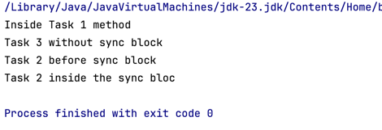

# Java Multithreading: Monitor Lock (Intrinsic Lock) 🧵🔒

## 1. What is a Monitor Lock?
- A **monitor lock** belongs to an object, not a thread, method, or class.
- It ensures that only **one thread** executes synchronized code on the locked object at a time.

## 2. Who Acquires the Lock?
- A thread acquires the monitor lock when entering a **synchronized method** or **block**.
- Other threads trying to access synchronized code on the **same object** must wait.

## 3. Synchronized Methods
- A **synchronized instance method** locks the entire object (`this`).
- A **static synchronized method** locks the class (`Class.class`).
- Only **one thread** can execute any synchronized method of the same object at a time.

## 4. Synchronized Blocks
- Locks only a **specific block of code** instead of the whole method.
- More **flexible** and allows parallel execution of non-synchronized parts.
- Can lock **any object**, not just `this`.

## 5. Key Differences: Synchronized Method vs. Synchronized Block

| Feature             | Synchronized Method                  | Synchronized Block                  |
|---------------------|--------------------------------------|-------------------------------------|
| **Lock Scope**      | Entire method                        | Only a specific block              |
| **Lock Object**     | `this` (or `Class.class` for static) | Any specified object               |
| **Thread Blocking** | All synchronized methods on the object are blocked | Only the block is locked |
| **Flexibility**     | Less flexible                        | More fine-grained control          |
| **Performance**     | May cause unnecessary blocking       | More efficient                     |

## 6. What Happens When a Thread Acquires the Lock?
- Other threads must **wait** until the lock is released.
- Only **one thread at a time** can enter the synchronized method/block of the same locked object.
- Once the thread exits, the lock is **released**, and the next waiting thread acquires it.

🚀 **Use synchronized blocks when possible for better performance!**

---

## Additional Insights: Instance-Level vs. Class-Level Locking

### Your Question:
> "Also, a thread which uses some other object of that class can do anything, right? As it was an instance-level lock, like for a fixed instance. But what if I want to lock the method so that no other thread of any object can come to that block?"

### Answer:
Yes, you're absolutely right! If a method is synchronized at the **instance level** (e.g., using `synchronized` on an instance method or block with `this`), it only locks that **specific object instance**. Other threads using **different instances** of the same class can execute the method concurrently.

#### How to Lock a Method for All Threads, Regardless of Object Instances?
To ensure that **no thread of any object instance** can enter the method, you need a **class-level lock**. This can be achieved in two ways:

1. **Using `static synchronized` Method (Class-Level Lock)**
    - A `static synchronized` method locks the **class object** (`Class.class`) instead of an instance.
    - All threads, regardless of which object they are using, must wait for the lock to be released.

2. **Using `synchronized` Block on `Class.class`**
    - Instead of locking `this`, use `synchronized (ClassName.class)`.
    - This ensures that all instances share the **same lock**, blocking threads across all objects.

#### Comparison: Instance-Level vs. Class-Level Locking

| Lock Type                              | Lock Scope         | Effect                                                                 |
|----------------------------------------|--------------------|-----------------------------------------------------------------------|
| **Instance-Level** (`synchronized` method or `synchronized(this)`) | Specific object instance | Other instances are not affected; threads using different objects can run concurrently |
| **Class-Level** (`static synchronized` method or `synchronized(Class.class)`) | Entire class      | Only one thread can execute the synchronized method/block across all instances |

🚀 **Use class-level locking when you need to synchronize access to shared resources across all instances!**

| Feature               | Instance-Level (`synchronized` method) | Class-Level (`static synchronized` method) |
|-----------------------|----------------------------------|----------------------------------|
| **Lock Object**       | `this` (current instance)       | `Class.class` (single lock for all instances) |
| **Scope**            | One thread per instance         | One thread for entire class     |
| **Other Instances?**  | Not affected                   | Affected (all instances share the lock) |
| **Alternative Block Equivalent** | `synchronized (this) {}`  | `synchronized (Example.class) {}` |

##### Output from the code example : 

Here thread1 acquired the monitor lock of obj1, and those syn method can be called only with the thread having the monitor lock of that object. 

Task 3 ran smoothly as monitor locks were not required for them. 

Also keep note this all was instane level lock it means this all is just for `obj1`. If you start a new thread with some other object obj2 then there wil be no blocking. For class level lock you need to use `static synchronized` keyword or `.class way of sync block`.